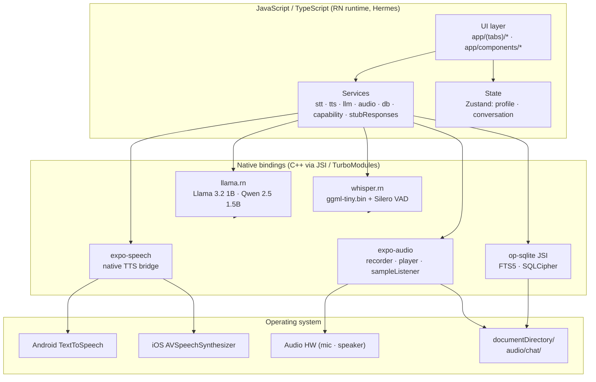
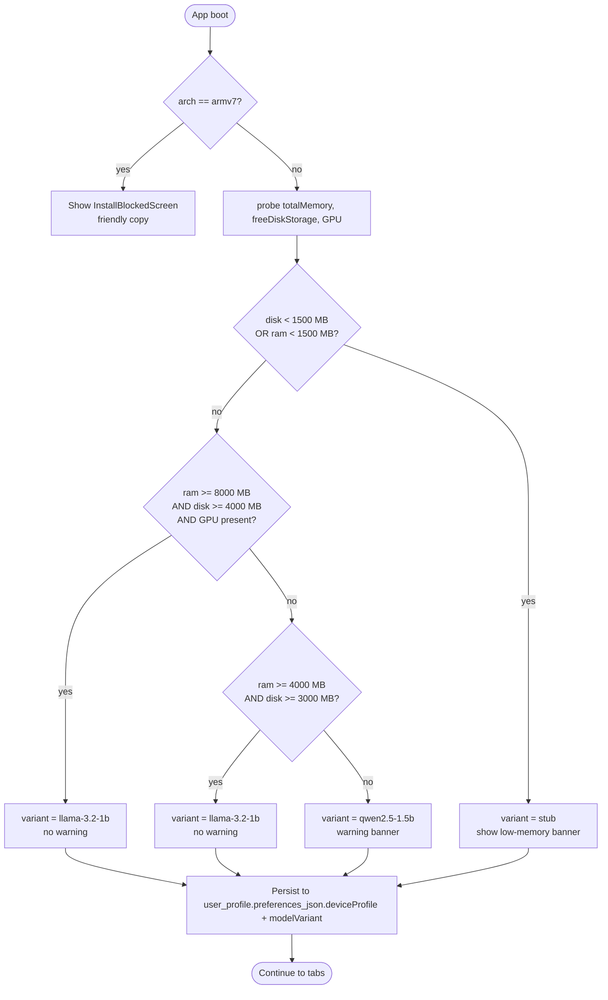

# Design: english-practice-mobile-offline-mvp

**Phase:** sdd-design · **Change:** `english-practice-mobile-offline-mvp` · **Status:** ready for sdd-tasks

This document binds the proposal (`## What Changes`) and the 10 delta specs (`openspec/changes/.../specs/*.md`) to concrete implementations. It resolves every detail the specs intentionally deferred (topic-to-prompt map, stub-mode response table, capability decision tree, waveform visual contract, settings screen layouts, performance measurement).

---

## 1. Architecture overview



**Where each layer runs:**

- **JavaScript / TypeScript** owns UI, service orchestration, state, and the LLM system-prompt composition. All services are pure functions over the native bindings — no I/O fan-out from the JS layer.
- **Native bindings** are the boundary: `whisper.rn`, `llama.rn`, `expo-audio`, `expo-speech`, `op-sqlite`. These are C++/Objective-C/Java+Swift modules exposed through JSI/TurboModules under Expo SDK 54's New Architecture.
- **Operating system** owns TTS engine selection, audio hardware, and the filesystem under `documentDirectory`. Nothing in this layer is reachable from JS without a native binding.

**Boundary guarantee — `NoNetworkPolicy`.** Every service module imports a single `assertNoNetwork(label)` helper from `services/capability.ts`. The helper asserts at runtime that `expo-network.getNetworkStateAsync().isConnected === false || label === 'allowed'`. Called once per service entry point (STT init, LLM load, TTS speak, DB open). Any module caught issuing a fetch attempt fails its boot assertion and the app surfaces a blocking offline-only error screen.

---

## 2. Module / folder structure

```text
practice/                                       # /home/dev/Dev/Practice
├── app/                                        # Expo Router root
│   ├── App.tsx                                 # RN entry + providers (Zustand, DB)
│   ├── _layout.tsx                             # Expo Router root layout, capability gate
│   ├── (tabs)/
│   │   ├── _layout.tsx                         # Tab bar: Topics · Chat · Settings
│   │   ├── index.tsx                           # Home — 8 topic cards grid
│   │   ├── chat.tsx                            # Active conversation screen (waveform host)
│   │   └── settings.tsx                        # Settings hub
│   ├── settings/
│   │   ├── conversation.tsx                    # persona, voice locale, encryption toggle
│   │   ├── models.tsx                          # variant swap, reset to auto
│   │   └── privacy.tsx                         # encryption status, audio retention, data export
│   ├── components/
│   │   ├── Waveform.tsx                        # 64-bar SVG, 4 modes (Section 9)
│   │   ├── TopicCard.tsx                       # one bundled PNG + label
│   │   ├── HoldToTalk.tsx                      # gesture wrapper around Waveform
│   │   └── MessageBubble.tsx                   # chat history rows
│   ├── services/
│   │   ├── stt.ts                              # whisper.rn wrapper (Section 3)
│   │   ├── tts.ts                              # expo-speech wrapper
│   │   ├── llm.ts                              # llama.rn wrapper + summarizer
│   │   ├── audio.ts                            # expo-audio recorder / player / sampleListener
│   │   ├── db.ts                               # op-sqlite + migrations + prune
│   │   ├── capability.ts                       # NoNetworkPolicy + capability probe
│   │   └── stubResponses.ts                    # curated low-memory responses (Section 7)
│   ├── state/
│   │   ├── profile.ts                          # Zustand singleton profile store
│   │   └── conversation.ts                     # Zustand active-conversation store
│   ├── migrations/
│   │   └── 001_init.sql                        # verbatim schema (Section 5)
│   └── config/
│       ├── modelManifest.ts                    # variant → file path + checksum
│       ├── topics.ts                           # 8 topic ids + prompt fragments (Section 7)
│       └── locales.ts                          # BCP-47 list, voice quality probe
├── assets/
│   ├── models/
│   │   ├── LICENSE.md                          # per-model license citations
│   │   ├── stt/ggml-tiny.bin                   # ~78 MB · MIT
│   │   └── llm/
│   │       ├── Llama-3.2-1B-Instruct-Q4_K_M.gguf      # ~870 MB · Llama 3.2 Community
│   │       └── Qwen2.5-1.5B-Instruct-Q4_K_M.gguf      # ~1.1 GB · Apache-2.0
│   ├── topics/                                 # 1024×1024 PNGs, ~2 MB each
│   │   ├── travel.png
│   │   ├── food.png
│   │   ├── work.png
│   │   ├── hobbies.png
│   │   ├── weather.png
│   │   ├── shopping.png
│   │   ├── health.png
│   │   └── daily-life.png
│   └── icons/                                  # tab bar + settings glyphs (bundled)
├── openspec/
│   ├── config.yaml                             # apply.tdd flips true in bootstrap
│   └── changes/english-practice-mobile-offline-mvp/
│       ├── proposal.md
│       ├── design.md                           # this file
│       ├── specs/
│       └── tasks/                              # written by sdd-tasks
├── eas.json                                    # preview + production profiles
├── app.json                                    # Expo SDK 54 config + plugins
├── package.json                                # whisper.rn, llama.rn, expo-audio, op-sqlite, zustand, svg, reanimated
├── tsconfig.json                               # strict mode
└── .husky/pre-commit                           # tsc --noEmit && eslint .
```

**Per-folder responsibilities** (one sentence each):
- `app/` — Expo Router file-based routes; root layout runs the capability gate before any tab renders.
- `app/components/` — pure presentational components with no service imports.
- `app/services/` — single-function wrappers around native bindings; the only place the JS layer touches the OS.
- `app/state/` — Zustand stores; pure JS, hydrated from `db.ts` on boot.
- `app/migrations/` — versioned SQL; applied by `runMigrations(db)` inside one transaction.
- `app/config/` — static lookup tables (topic prompts, model paths); bundled, never fetched.
- `assets/models/` — bundled GGUF and ggml binaries; SHA-256 verified at install.
- `assets/topics/` — bundled illustrations; never fetched.
- `openspec/changes/...` — SDD artifacts for this change only.

---

## 3. Service interfaces (TypeScript signatures)

```ts
// app/services/stt.ts
export type SttLocale = 'auto' | 'en' | 'es';
export interface SttResult {
  text: string;
  detectedLocale: 'en' | 'es';
  durationMs: number;
}
export async function transcribe(
  audio: AudioBuffer,
  locale?: SttLocale
): Promise<SttResult>;
export function getNetworkBytesSent(): number; // offline-only guard
```

```ts
// app/services/tts.ts
export type BCP47 = 'en-US' | 'en-GB' | 'es-ES' | 'es-MX';
export interface TtsOptions {
  locale?: BCP47;        // defaults to user_profile.preferences.ttsLocale
  voiceId?: string;      // overrides auto-pick; stored in preferences.ttsVoiceId
  rate?: number;         // 0.5–2.0; defaults to 1.0
}
export interface TtsResult {
  audioPath: string;     // documentDirectory/audio/chat/<convId>/<msgId>.wav
  durationMs: number;
}
export async function speak(text: string, opts?: TtsOptions): Promise<TtsResult>;
export function stopSpeaking(): void;          // for barge-in
export function getNetworkBytesSent(): number;
```

```ts
// app/services/llm.ts
export interface ConversationTurn { role: 'user' | 'assistant' | 'system'; text: string; }
export interface ProfileContext {
  personaName: string;          // default "Coach"
  level: 'A1' | 'A2' | 'B1' | 'B2' | 'C1' | 'C2';
  topicId: TopicId;             // see Section 7
  practiceLocale: BCP47;
  summary: string;              // rolling per-10-turn summary
  recentTurns: ConversationTurn[];  // sliding window
}
export interface TokenChunk { token: string; index: number; }
export async function* generateReply(
  turns: ConversationTurn[],
  profileContext: ProfileContext
): AsyncIterable<TokenChunk>;
export async function summarize(turns: ConversationTurn[]): Promise<string>;
export function getNetworkBytesSent(): number;
```

```ts
// app/services/audio.ts
export interface AudioBuffer { uri: string; durationMs: number; sampleRate: 16000; }
export interface RecordingOpts { sampleRate?: 16000; channels?: 1; }
export function startRecording(opts?: RecordingOpts): Promise<void>;
export async function stopRecording(): Promise<AudioBuffer>;
export async function play(path: string): Promise<void>;
export function subscribeAmplitude(cb: (rms: number) => void): () => void;  // returns Unsubscribe
export function getNetworkBytesSent(): number;
```

```ts
// app/services/db.ts
export interface Migration { id: number; sql: string; }
export const migrations: Migration[];       // seeded with 001_init.sql
export function openDb(opts?: { encryptionKey?: string }): Promise<Db>;
export async function runMigrations(db: Db): Promise<void>;
export async function getProfile(): Promise<UserProfileRow>;
export async function updateProfile(patch: Partial<UserProfileRow>): Promise<void>;
export async function insertMessage(m: MessageInsert): Promise<string>;       // returns id
export async function searchMessages(q: string): Promise<MessageRow[]>;       // FTS5
export async function pruneOrphanAudio(): Promise<number>;                     // returns count deleted
```

```ts
// app/services/capability.ts
export type Arch = 'arm64' | 'armv7' | 'x86_64';
export interface DeviceCapability {
  arch: Arch;
  totalMemoryMB: number;
  freeDiskMB: number;
  hasAccelerator: boolean;       // Metal on iOS, OpenCL on Android
}
export type ModelVariant = 'llama-3.2-1b' | 'qwen2.5-1.5b' | 'stub';
export interface VariantResolution { variant: ModelVariant; warning?: string; stubMode: boolean; }
export async function probe(): Promise<DeviceCapability>;
export async function resolveModelVariant(cap: DeviceCapability): Promise<VariantResolution>;
export function assertNoNetwork(label: string): void;   // called by every service entry
```

---

## 4. Data flow: offline conversation turn

```mermaid
sequenceDiagram
    autonumber
    participant U as User
    participant W as Waveform
    participant A as audio.ts
    participant S as stt.ts
    participant L as llm.ts
    participant T as tts.ts
    participant DB as db.ts
    participant ST as conversation store

    U->>W: press-and-hold
    W->>A: startRecording({sampleRate:16000})
    A-->>W: amplitude stream (60 Hz)
    W->>W: render bars from amplitude
    U->>W: release
    W->>A: stopRecording()
    A-->>W: AudioBuffer
    W->>S: transcribe(buffer, 'auto')
    S-->>W: {text, detectedLocale, durationMs}
    alt text is empty
        W->>ST: setState('idle'); return
    end
    W->>ST: setState('processing'); append user turn
    ST->>DB: insertMessage(user)
    ST->>L: generateReply(history, profileContext)
    loop streaming tokens
        L-->>W: TokenChunk (Animated typing dots)
    end
    L-->>ST: full reply text
    ST->>T: speak(text, {locale: practiceLocale})
    T-->>ST: {audioPath, durationMs}
    ST->>W: setState('speaking')
    W->>A: play(audioPath) + subscribeAmplitude
    A-->>W: amplitude stream (playback)
    ST->>DB: insertMessage(assistant, ttsAudioPath)
    DB->>DB: message_fts INSERT (FTS5 mirror)
    Note over DB: Every 10 assistant turns → summarize → update conversation.summary
    U->>W: barge-in (VAD fires)
    W->>T: stopSpeaking() < 100 ms
    W->>A: startRecording (no button press)
```

**Network byte counter check.** After this entire sequence, `getNetworkBytesSent()` from each of `stt`, `tts`, `llm`, `audio`, `db` MUST return `0`. The `NoNetworkPolicy` assertion runs at the end of `generateReply`'s async iterator and at the end of `speak()`.

---

## 5. Persistence schema

```sql
-- app/migrations/001_init.sql
CREATE TABLE user_profile (
  id INTEGER PRIMARY KEY CHECK (id = 1),                       -- singleton invariant
  display_name     TEXT NOT NULL DEFAULT 'Learner',
  primary_locale   TEXT NOT NULL DEFAULT 'en-US',
  practice_locale  TEXT NOT NULL DEFAULT 'es-ES',
  level            TEXT NOT NULL DEFAULT 'A2'
                       CHECK (level IN ('A1','A2','B1','B2','C1','C2')),
  topics_json      TEXT NOT NULL DEFAULT '[]',
  preferences_json TEXT NOT NULL DEFAULT '{}',
  progress_json    TEXT NOT NULL DEFAULT '{}',
  created_at       INTEGER NOT NULL DEFAULT (unixepoch()),
  updated_at       INTEGER NOT NULL DEFAULT (unixepoch())
);

CREATE TABLE conversation (
  id          TEXT PRIMARY KEY,
  topic       TEXT,
  started_at  INTEGER NOT NULL,
  ended_at    INTEGER,
  summary     TEXT
);
CREATE INDEX idx_conv_started ON conversation(started_at DESC);

CREATE TABLE message (
  id               TEXT PRIMARY KEY,
  conversation_id  TEXT NOT NULL REFERENCES conversation(id) ON DELETE CASCADE,
  role             TEXT NOT NULL CHECK (role IN ('user','assistant','system')),
  text             TEXT NOT NULL,
  stt_audio_path   TEXT,
  tts_audio_path   TEXT,
  created_at       INTEGER NOT NULL,
  tokens_used      INTEGER
);
CREATE INDEX idx_message_conv_time ON message(conversation_id, created_at);
CREATE INDEX idx_message_role      ON message(role);

CREATE VIRTUAL TABLE message_fts USING fts5(
  text,
  content='message',
  content_rowid='rowid',
  tokenize='unicode61 remove_diacritics 2'
);

-- FTS5 sync triggers (kept inside the same migration; one transaction)
CREATE TRIGGER message_ai AFTER INSERT ON message BEGIN
  INSERT INTO message_fts(rowid, text) VALUES (new.rowid, new.text);
END;
CREATE TRIGGER message_ad AFTER DELETE ON message BEGIN
  INSERT INTO message_fts(message_fts, rowid, text) VALUES('delete', old.rowid, old.text);
END;
CREATE TRIGGER message_au AFTER UPDATE ON message BEGIN
  INSERT INTO message_fts(message_fts, rowid, text) VALUES('delete', old.rowid, old.text);
  INSERT INTO message_fts(rowid, text) VALUES (new.rowid, new.text);
END;
```

**`user_profile` singleton invariant.** The `CHECK (id = 1)` constraint plus the Zustand hydration contract guarantees one row. `getProfile()` does `SELECT ... WHERE id = 1 LIMIT 1`; `updateProfile(patch)` does `UPDATE ... WHERE id = 1` — there is never an INSERT after the first run. First-boot seed: `INSERT INTO user_profile (id) VALUES (1)`.

**SQLCipher toggle point.** `openDb({encryptionKey?})` reads `user_profile.preferences_json.encryptionEnabled` and `Keychain.getGenericPassword('db-key')`. If enabled AND a key is present, `op-sqlite` is opened with `encryptionKey`; otherwise plain SQLite. The toggle requires an app restart (per `settings.md` REQ-3).

**Audio file layout.** Filesystem paths:

```
FileSystem.documentDirectory + 'audio/chat/<conversationId>/<msgId>_<role>.wav'
```

`<role>` is `user` (STT recording) or `assistant` (TTS output). The DB row stores the same path in `message.stt_audio_path` or `message.tts_audio_path`.

**TTL pruning.** `db.ts:pruneOrphanAudio()` is invoked from `app/(tabs)/chat.tsx` mount via `useEffect`. It selects all files in `audio/chat/` with `mtime > 24h` whose relative path is not referenced by any `message.stt_audio_path` or `message.tts_audio_path`, then deletes them. Referenced files are preserved regardless of age.

---

## 6. State management (Zustand)

### `app/state/profile.ts`

```ts
interface ProfileState {
  row: UserProfileRow;                                   // hydrated once on boot
  hydrated: boolean;
  hydrate: () => Promise<void>;                          // calls db.getProfile()
  setLevel: (l: CEFRLevel) => Promise<void>;
  setPracticeLocale: (l: BCP47) => Promise<void>;
  setPersonaName: (n: string) => Promise<void>;
  setModelVariant: (v: ModelVariant) => Promise<void>;
  setEncryptionEnabled: (on: boolean) => Promise<void>;
  setLowMemoryMode: (on: boolean) => Promise<void>;
  bumpProgress: (patch: Partial<Progress>) => Promise<void>;
}
export const useProfileStore = create<ProfileState>(/* impl */);
// Selectors
export const selectPersona    = (s: ProfileState) => s.row.preferences_json.personaName;
export const selectLevel      = (s: ProfileState) => s.row.level;
export const selectTopic      = (s: ProfileState) => s.row.practice_locale;
export const selectModelVar   = (s: ProfileState) => s.row.preferences_json.modelVariant;
```

**Initial state** matches the DB seed row exactly (display_name `Learner`, level `A2`, practice_locale `es-ES`, personaName `Coach`, modelVariant resolved by capability probe).

**Hydration rule.** `_layout.tsx` calls `useProfileStore.getState().hydrate()` once before any tab renders; the chat tab is gated on `hydrated === true`.

**Invalidation rule.** Every mutation round-trips through `db.updateProfile(patch)` and updates the store row in the same tick. **Any write that changes `personaName`, `level`, `practiceLocale`, `topics_json`, or `progress_json.summary` MUST bump `useConversationStore.getState().bumpSystemPromptVersion()`** so the LLM re-composes the system prompt on the next turn.

### `app/state/conversation.ts`

```ts
interface ConversationState {
  activeId: string | null;
  messages: MessageRow[];
  systemPromptVersion: number;            // bumped on profile change
  summaryCache: string;                   // mirrors conversation.summary
  loadConversation: (id: string) => Promise<void>;
  startNew: (topic: TopicId) => Promise<string>;   // returns new conversation id
  endActive: () => Promise<void>;
  appendUserTurn: (text: string, audioPath: string) => Promise<void>;
  appendAssistantTurn: (text: string, audioPath: string) => Promise<void>;
  bumpSystemPromptVersion: () => void;
}
export const useConversationStore = create<ConversationState>(/* impl */);
```

**Bind to LLM streaming.** The chat screen reads `messages` and `systemPromptVersion`; on every change of `systemPromptVersion` it recomputes the prompt via `llm.composeSystemPrompt(profile, summary, recentTurns)` (Section 7).

---

## 7. LLM system prompt composition

### Template (rebuilt every turn)

```
<|begin_of_text|>
You are {personaName}, a patient English-practice companion.
Practice locale: {practiceLocale} (e.g. en-US English). Respond in this locale.
User CEFR level: {level}. Adjust vocabulary and grammar accordingly. {levelHint}

Active topic: {topicId}.
{topicFragment}

{summaryBlock}

Recent turns (oldest → newest, sliding window of last 10 turns, bounded within the **4096-token total context budget** specified in §12 — when the prompt approaches 3.6k tokens, older turns are dropped to keep a safety margin for the assistant reply):
{recentTurns}

<|eot_id|><|start_header_id|>user<|end_header_id|>
{userTurn}<|eot_id|><|start_header_id|>assistant<|end_header_id|>
```

`levelHint` is a short style hint keyed off CEFR — e.g. A2: *"Use short sentences and high-frequency vocabulary. Avoid idioms."*, B1: *"Use everyday vocabulary, simple compound sentences, occasional phrasal verbs."*

### Topic → system prompt injection map (deferred from `specs/topics.md`)

| Topic id | Prompt fragment (the `{topicFragment}` substitution) |
|----------|------------------------------------------------------|
| `travel` | "Scenario: airports, hotels, customs, asking for directions, currency exchange, public transit. Use travel vocabulary and phrases." |
| `food` | "Scenario: restaurants, ordering, recipes, dietary preferences, grocery shopping, kitchen items. Use food vocabulary and polite request forms." |
| `work` | "Scenario: meetings, emails, job interviews, workplace small talk, time management, scheduling. Use professional but friendly register." |
| `hobbies` | "Scenario: sports, music, reading, crafts, weekend activities, creative pursuits. Use leisure vocabulary and present-tense descriptions." |
| `weather` | "Scenario: forecasts, seasons, climate, what to wear, small talk about conditions. Use weather vocabulary and comparative forms." |
| `shopping` | "Scenario: stores, prices, bargaining, returns, online shopping, trying on clothes. Use transactional language and numbers." |
| `health` | "Scenario: doctor visits, symptoms, pharmacy, exercise, mental wellness. Use health vocabulary and polite clarification requests." |
| `daily-life` | "Scenario: routines, family, home, transportation, daily schedule. Use everyday vocabulary and time expressions." |

Each fragment is bilingual-friendly by design — both EN practice and ES practice are supported.

### Low-memory stub response table (deferred from `specs/capability-detection.md`)

Lives in `app/services/stubResponses.ts`. Selection rule: pick by current `topicId`; if topic is `null` (no conversation started), use greeting by detected locale.

| Topic / key | Response (ES then EN) | Source |
|-------------|------------------------|--------|
| `greeting_en` | "Hi! How are you feeling today? Tell me about your day." | general |
| `greeting_es` | "¡Hola! ¿Cómo te sientes hoy? Cuéntame sobre tu día." | general |
| `travel` | "¿Has viajado a algún lugar interesante recientemente? / Have you traveled somewhere interesting recently?" | topic pivot |
| `food` | "¿Qué cocinaste o comiste hoy? / What did you cook or eat today?" | topic pivot |
| `work` | "¿Cómo te fue en el trabajo hoy? / How was work today?" | topic pivot |
| `health` | "¿Cómo te sientes físicamente hoy? / How do you feel physically today?" | topic pivot |
| `generic_continue` | "Cuéntame más sobre eso. / Tell me more about that." | fallback |
| `generic_wrap` | "Interesante. ¿Y qué pasó después? / Interesting. What happened next?" | fallback |

The stub returns the response that matches `(topicId, lastUserLocale)`. Stub mode is signalled by `useConversationStore` when `profile.preferences_json.modelVariant === 'stub'`; the chat screen swaps the Waveform to a neutral "stub mode" indicator and disables amplitude-driven bars.

### Persona-rename reload behavior

`useProfileStore.setPersonaName(name)` flushes to DB in the same tick and calls `useConversationStore.bumpSystemPromptVersion()`. The next LLM call rebuilds the prompt with `personaName = "Sam"` (or whatever the user typed). The VAD-driven recorder and TTS pipeline are unaffected — only the LLM prompt changes.

---

## 8. Capability detection algorithm



The probe is implemented by `services/capability.ts:probe()` using `expo-device.getPlatformFeaturesAsync()`, `expo-application.getIosIdForVendorAsync()` for arch flags, and a tiny native module wrapper for `freeDiskStorage`. Result is cached in `user_profile.preferences_json.deviceProfile` after the first successful probe.

---

## 9. Waveform visual contract (deferred from `specs/audio-waveform.md`)

**Component shape:** `<Waveform mode={...} amplitudeSource={...} onPressIn onPressOut />`

| Mode | Visual | Trigger source | A11y label |
|------|--------|----------------|------------|
| `idle` | 64 bars at 5% of max height; "Tap and hold to talk" prompt below | none | "Tap and hold to talk" |
| `listening` | 64 bars animated from live `rms`; bars peak at max height when loud | `subscribeAmplitude(rms)` during `startRecording()` | "Listening, release to send" |
| `processing` | central bar pulses at 1 Hz; others at 5% min | none; CSS keyframes | "Processing your speech" |
| `speaking` | 64 bars animated from playback `rms`; same height mapping as `listening` | `subscribeAmplitude(rms)` during `play()` | "Coach is speaking, interrupt by speaking" |

**Visual specs** (locked here, deferring them here was the spec's intent):

- Bars: **64** total, **2 px** wide, **1 px** gap, **32 px** max height, baseline 5% (≈ 1.6 px) when idle.
- Color tokens: `--bg` (transparent over the tab bg), `--bar-idle` (neutral gray), `--bar-active` (primary tint), `--bar-active-peak` (peak marker, brighter shade). Tokens defined in `app/components/Waveform.tsx` `StyleSheet`; theme is read from `useColorScheme()`.
- Render primitive: `react-native-svg` `<Rect>` per bar, animated height via `react-native-reanimated` `useSharedValue` + `withTiming`.

**Render budget.** `useAudioSampleListener` (or the `expo-audio` polyfill) emits at ~60 Hz during recording/playback. The component keeps a 64-element circular buffer of the most recent samples; `requestAnimationFrame` runs at 30 fps and writes the buffer to shared values. Samples that arrive between RAF ticks are dropped (not queued) — the buffer always reflects the most recent, not the oldest backlog. This keeps the JS thread free for touch + scroll.

**Accessibility.** The container `View` exposes `accessibilityRole="button"` and a dynamic `accessibilityLabel` per the table above. `accessibilityHint="Press and hold to record"` is set in idle/listening modes. VoiceOver/TalkBack will read the label change on mode transition. Live-region announcements (`accessibilityLiveRegion="polite"`) on `speaking → listening` transition so screen-reader users hear "Listening" without touching.

---

## 10. Settings screens

### `app/settings/conversation.tsx` — binds `specs/settings.md` REQ-1

```
+----------------------------------------+
| Settings · Conversation                |
|                                        |
| Persona name                           |
| [ Coach                            ]   |
|                                        |
| Voice locale                           |
| ( ) Auto (detect from device)          |
| (•) en-US                              |
| ( ) en-GB                              |
| ( ) es-ES                              |
| ( ) es-MX                              |
|                                        |
| [ Save ]                               |
+----------------------------------------+
```

- Save calls `useProfileStore.setPersonaName` + `setPracticeLocale` (which is the assistant-locale override).
- Next LLM turn reflects persona; next TTS call reflects locale.
- Default: persona `Coach`, locale `Auto` — matches product default #3 + #1.

### `app/settings/models.tsx` — binds `specs/settings.md` REQ-2

```
+----------------------------------------+
| Settings · Models                      |
|                                        |
| Current variant: Llama 3.2 1B          |
| Bundle present: ✓                      |
|                                        |
| ( ) Llama 3.2 1B Instruct Q4_K_M       |
|     Primary · ~870 MB                  |
| ( ) Qwen 2.5 1.5B Instruct Q4_K_M      |
|     Fallback · ~1.1 GB                 |
| ( ) Auto (recommended)                 |
|                                        |
| [ Apply on next launch ]               |
+----------------------------------------+
```

- Selection disables any variant whose asset is missing from `assets/models/llm/` (per REQ-2 scenario "Asset missing").
- "Apply on next launch" call sets `modelVariant` and surfaces a restart banner.
- "Reset to auto" button clears the override and re-runs `capability.resolveModelVariant`.

### `app/settings/privacy.tsx` — binds `specs/settings.md` REQ-3

```
+----------------------------------------+
| Settings · Privacy                     |
|                                        |
| Encryption at rest        [ Off  ▢ ]   |
| [ When ON, you'll be asked to set      |
|   a passphrase and restart the app ]   |
|                                        |
| Low-memory mode           [ Off  ▢ ]   |
| [ When ON, the fallback model is       |
|   forced and waveform buffering        |
|   is disabled ]                        |
|                                        |
| Audio retention           ( ) 24h      |
|                          (•) Keep      |
|                                        |
| [ Export profile data ]                |
| [ Delete all data ]                    |
+----------------------------------------+
```

- Encryption toggle requires a passphrase prompt; on confirm, sets `encryptionEnabled = true`, stores key in `Keychain`, shows "Restart required" banner.
- Low-memory mode toggle persists to `preferences_json.lowMemoryMode`; on next launch the capability probe is bypassed and `modelVariant` is forced to `qwen2.5-1.5b`.
- Export/Delete write to `FileSystem.cacheDirectory + 'profile-export.json'` and `db.purge()` respectively.

---

## 11. Migration plan

### Sub-change 1 — `bootstrap-toolchain-and-skeleton` (size M)

**Day-1 files (created in this order):**

1. `package.json` — `npx create-expo-app` TS template, SDK 54, New Architecture. Add: `whisper.rn`, `llama.rn`, `expo-audio`, `expo-speech`, `op-sqlite`, `zustand`, `react-native-svg`, `react-native-reanimated`, `expo-device`, `expo-application`, `expo-file-system`, `expo-secure-store`.
2. `eas.json` — `preview` + `production` profiles, cloud build config.
3. `app.json` — pin SDK version, `expo.plugins` for native modules, `ios.infoPlist.NSMicrophoneUsageDescription`, `android.permissions.RECORD_AUDIO`.
4. `tsconfig.json` — strict mode on; `noUncheckedIndexedAccess`.
5. `.eslintrc.cjs`, `.prettierrc`, `.husky/pre-commit` — `tsc --noEmit && eslint .`.
6. Folder skeleton: `app/{components,services,state,migrations,config}/`, `app/(tabs)/`, `app/settings/`, `assets/{models,topics,icons}/`.
7. `app/migrations/001_init.sql` — verbatim schema from Section 5.
8. `app/services/db.ts` — `openDb`, `runMigrations`, `getProfile`, `updateProfile`, `insertMessage`, `searchMessages`, `pruneOrphanAudio` stubs.
9. `app/state/profile.ts` — Zustand store, hydrated from DB; selectors.
10. `app/(tabs)/_layout.tsx` — tab bar with placeholder screens.

**LOC budget:** ~600 LOC across these files (well under the 800-line review budget). Configure Jest + RN-TEST in this sub-change.

### Sub-change 2 — `model-assets` (size M, depends on Sub-change 1)

1. `assets/models/stt/ggml-tiny.bin` — vendor under MIT (78 MB; LFS).
2. `assets/models/llm/Llama-3.2-1B-Instruct-Q4_K_M.gguf` — 870 MB, LFS.
3. `assets/models/llm/Qwen2.5-1.5B-Instruct-Q4_K_M.gguf` — 1.1 GB, LFS.
4. `assets/models/LICENSE.md` — per-model license citations.
5. `assets/models/SHA256SUMS` — verified at install by `capability.ts:probe()`.
6. `app/services/capability.ts` — full implementation of `probe` + `resolveModelVariant` + `assertNoNetwork`.
7. `app/services/stubResponses.ts` — the curated response table from Section 7.
8. `app/config/modelManifest.ts` — variant → file path + checksum + license.

**LOC budget:** ~400 LOC (mostly capability.ts).

### Sub-change 3 — `chat-mvp` (size L, depends on Sub-changes 1 and 2)

1. `app/services/stt.ts` — `whisper.rn` wrapper, VAD-driven silence trim, energy-threshold fallback.
2. `app/services/tts.ts` — `expo-speech` wrapper, voice auto-pick, `stopSpeaking` for barge-in.
3. `app/services/llm.ts` — `llama.rn` wrapper, `generateReply` async iterator, `summarize`.
4. `app/services/audio.ts` — `expo-audio` recorder / player / sample listener.
5. `app/state/conversation.ts` — Zustand active-conversation store.
6. `app/components/Waveform.tsx` — 64-bar SVG component per Section 9.
7. `app/components/TopicCard.tsx`, `MessageBubble.tsx`, `HoldToTalk.tsx`.
8. `app/(tabs)/index.tsx` — 8-card topic grid.
9. `app/(tabs)/chat.tsx` — chat host, hold-to-talk, barge-in, session lifecycle.
10. `app/(tabs)/settings.tsx` + `app/settings/{conversation,models,privacy}.tsx` — three settings screens from Section 10.
11. `assets/topics/*.png` × 8 — bundled illustrations.
12. **Session-end timer** (`specs/conversation.md` REQ-3 — explicit hardener): in `app/(tabs)/chat.tsx` an `AppState` listener arms a 5-minute `setTimeout` whenever the app goes to background or the screen becomes inactive. On fire, it calls `endActive()` which (a) writes `ended_at` on the active `conversation` row, (b) flushes any pending audio WAVs, and (c) runs the auto-summarize hook when `messages.length % 10 === 0`. Timer is cleared on foreground; explicit "End session" UI control short-circuits the timer.

**LOC budget:** ~1200 LOC. **This exceeds the 800-line review budget — `size:exception` required**, justified by the integration-spine nature of `chat-mvp`. Recommendation: split into two stacked PRs (services+state in PR-1, screens in PR-2) per `chained-pr` skill.

---

## 12. Performance budget

| Metric | Target | Measurement method |
|--------|--------|--------------------|
| Cold launch (boot → first chat screen) | ≤ 4 s on mid-range Android | `expo-performance` marks at boot; manual stopwatch on Pixel 6a reference |
| TTFT — primary LLM (Llama 3.2 1B) | ≤ 3 s for a 50-token reply | `llm.ts` emits `ttft` metric on first `TokenChunk`; logged to `progress_json.metrics` |
| TTFT — fallback (Qwen 2.5 1.5B) | ≤ 5 s | same as above |
| STT (10s utterance, mid Android) | ≤ 3 s | `stt.ts` emits `inferenceMs`; manual stopwatch on Snapdragon 7-gen reference |
| TTS first-byte | ≤ 200 ms | `tts.ts` `Date.now()` delta between `speak()` and first `onStart` callback |
| Memory resident during conversation (RN runtime + LLM ctx 4k + STT model + WAV buffers) | ≤ 1.8 GB | `expo-performance.getMemoryUsage()` sampled every 30s during manual 5-minute conversation |
| Battery drain (30-minute conversation) | ≤ 15 % | manual discharge test on a fully charged Pixel 6a, 30-min scripted EN↔ES conversation |

Smoke tests run on a Pixel 6a (Snapdragon 7-gen 1, 8 GB RAM) and an iPhone 13 (A15, 4 GB RAM). Failed targets block the `chat-mvp` completion criterion.

---

## 13. Testing approach

| Layer | What to test | Approach |
|-------|--------------|----------|
| **Unit** | Service signature contracts; prompt composition (Section 7); capability decision tree (Section 8); profile store transitions; FTS5 search results | Jest + RN-TEST (configured in `bootstrap-toolchain-and-skeleton`); services mocked via jest mocks for whisper.rn / llama.rn / expo-audio |
| **Integration** | `db.ts` migration round-trip on in-memory SQLite; STT → LLM mock round-trip; pruneOrphanAudio deletes only orphans; encryption toggle opens DB with key | Jest + `@op-engineering/op-sqlite-test` harness |
| **Manual smoke** | Full bilingual EN↔ES 5-min conversation; profile persistence across cold restart; settings persistence; encryption round-trip (toggle on, restart, verify on-disk DB unreadable as plain SQLite); low-memory mode; armv7 install-blocked screen; barge-in during TTS | Pre-launch checklist on Pixel 6a + iPhone 13; outcomes recorded in `openspec/changes/english-practice-mobile-offline-mvp/verify.md` |

**TDD policy.** The current `openspec/config.yaml` has `apply.tdd: false` and `strict_tdd: false`. The `bootstrap-toolchain-and-skeleton` sub-change MUST (a) install Jest + `@testing-library/react-native` + `@op-engineering/op-sqlite-test`, (b) flip `openspec/config.yaml` `apply.tdd: true` and set `verify.test_command: "jest --ci"`. After that flip, every subsequent task in `chat-mvp` is expected to land tests alongside production code.

---

## 14. Risks carried forward

| # | Risk | Severity | Design-level mitigation |
|---|------|----------|-------------------------|
| 1 | Llama 3.2 1B + RN runtime OOM on 3 GB-RAM Android 10 | HIGH | Capability probe (Section 8) auto-selects Qwen; stub mode below 1.5 GB disk |
| 2 | Whisper tiny WER 8–15% on accented English / regional Spanish | MED | Documented upgrade path to `ggml-base.bin` (~148 MB) — single-line swap in `stt.ts` |
| 3 | Native TTS voice quality varies by device / OS | MED | First-launch neural-voice probe; documented Piper VITS swap path in `tts.ts` |
| 4 | Total install ~50 MB + ~1.3 GB model assets may exceed patience | MED | Lazy-load models on first launch with progress UI; per-language opt-in for ES |
| 5 | EAS Build free tier limited to 30 builds / month | LOW | Prefer local `expo run:android --device` for inner loop |
| 6 | whisper.rn VAD adds ~30 MB RAM during recording | LOW | Accepted; tracked |
| 7 | VAD model fails to load (corrupted asset, ABI mismatch) | MED | `try/catch` in `stt.ts:initVad()`; energy-threshold fallback; non-blocking toast |
| 8 | Migration sequencing failure leaves app with no DB | MED | `runMigrations(db)` wraps all SQL in one transaction; blocking "Storage error — reinstall required" screen on failure |
| 9 | 32-bit Android dropped (armv7 < 2% market in 2026) | LOW | `InstallBlockedScreen` per Section 8; documented in README |
| 10 | iOS signing requires Apple Developer account ($99/yr) | LOW | Documented in `CONTRIBUTING.md`; not blocking v1 |

---

## 15. Out of scope reminders

Mirrors `## Out of scope` from `proposal.md`:

- iPad-specific layouts · watchOS · Android Auto · desktop targets.
- Cloud sync · multi-device handoff · account system.
- Voice cloning · custom persona authoring UI.
- Multi-speaker / group sessions.
- Voice activity logs · analytics dashboards · A/B testing.
- Achievements / gamification beyond basic streak counter.
- Formal accessibility audit beyond Expo defaults.
- Piper VITS high-quality TTS (architecture preserves the upgrade path).
- Per-user custom topic authoring.

---

## 5 product defaults — placement & override path

| # | Default | Section where it lives | Override path |
|---|---------|------------------------|---------------|
| 1 | TTS locale auto-detect | §7 prompt template (`practiceLocale`), §10 Settings → Conversation | Settings → Conversation → voice locale |
| 2 | 8 topics seeded | §7 topic-to-prompt map; §5 schema `topics_json` | Out of scope for v1 (no authoring UI) |
| 3 | Persona `"Coach"` | §7 prompt template (`personaName`); §6 profile store defaults | Settings → Conversation → persona name |
| 4 | No cap, auto-summarize every 10 turns | §7 prompt template (`summaryBlock`); §6 invalidation rule; §5 `conversation.summary` column | Settings → Conversation (turn cadence — out of scope for v1 UI, but cadence is in `progress_json.summaryCadence` if user changes mind in v2) |
| 5 | Bundle EN + ES upfront | §2 `assets/models/llm/*.gguf`; §3 STT multilingual; §3 TTS 4 locales | Settings → Conversation → practice locale |

All five defaults are baked into initial state and surfaced as starting values in Settings, never as fixed forever.
