# Tasks: english-practice-mobile-offline-mvp

## Overview

Decompose the 3 sub-changes (`bootstrap-toolchain-and-skeleton` → `model-assets` → `chat-mvp`) into 21 implementation tasks. Total estimated changed lines: ~2 155 (bootstrap ~665, model-assets ~260, LFS assets excluded, chat-mvp ~1 230). Chat-mvp exceeds the 800-line review budget by ~430 lines, so the orchestrator MUST surface a chained-pr vs size-exception decision before apply (delivery strategy is `single-pr`).

## Dependency graph (mermaid)

```mermaid
flowchart LR
  subgraph SC1[Sub-change 1 — bootstrap]
    T11[1.1 Expo init + skeleton] --> T12[1.2 EAS + perms] --> T13[1.3 lint + husky]
    T13 --> T14[1.4 Jest runner] --> T15[1.5 001_init.sql] --> T16[1.6 db.ts]
    T16 --> T17[1.7 profile store] --> T18[1.8 placeholder screens] --> T19[1.9 RED NoNetwork]
    T19 --> T110[1.10 TDD flip]
  end
  subgraph SC2[Sub-change 2 — model-assets]
    T110 --> T21[2.1 GREEN capability] --> T22[2.2 stubResponses] --> T23[2.3 modelManifest]
    T23 --> T24[2.4 vendor assets] --> T25[2.5 SHA256 verify]
  end
  subgraph SC3[Sub-change 3 — chat-mvp]
    T25 --> T31[3.1 services] --> T32[3.2 conversation store + summarizer]
    T32 --> T33[3.3 components] --> T34[3.4 screens] --> T35[3.5 topic PNGs + map]
    T32 --> T36[3.6 5-min timer + auto-summarize hook]
    T36 -.PR-1.- T35
    T35 -.PR-2.- T33
  end
```

## Sub-change 1 — bootstrap-toolchain-and-skeleton (M, ~665 LOC)

### Task 1.1: Init Expo SDK 54 TS project + folder skeleton + native modules
- **Status:** completed · **Files:** `package.json`, `app.json`, `tsconfig.json`, `app/{components,services,state,migrations,config}/.gitkeep`, `app/(tabs)/.gitkeep`, `app/settings/.gitkeep`, `assets/{models,topics,icons}/.gitkeep`
- **Dependencies:** none
- **Acceptance criteria:**
  - `npx expo --version` returns a SDK-54-capable CLI
  - `npx expo install` resolves `whisper.rn`, `llama.rn`, `expo-audio`, `expo-speech`, `op-sqlite`, `zustand`, `react-native-svg`, `react-native-reanimated`, `expo-device`, `expo-application`, `expo-file-system`, `expo-secure-store`
  - All skeleton folders exist; `app.json` New Architecture on
- **Estimated LOC:** ~150 · **Spec/§:** design §11 day-1 step 1, 6

### Task 1.2: Configure EAS profiles + native permissions
- **Status:** completed · **Files:** `eas.json`, `app.json` (edit plugins + permissions)
- **Dependencies:** 1.1
- **Acceptance criteria:**
  - `eas.json` declares `preview` + `production` profiles
  - `app.json` includes `ios.infoPlist.NSMicrophoneUsageDescription`, `android.permissions: ["RECORD_AUDIO"]`, plugin entries for native modules
  - `eas build --profile preview --platform android --non-interactive --dry-run` exits 0
- **Estimated LOC:** ~30 · **Spec/§:** design §11 day-1 step 2, 3

### Task 1.3: TypeScript strict + ESLint + Prettier + Husky pre-commit
- **Status:** completed · **Files:** `tsconfig.json` (strict + noUncheckedIndexedAccess), `.eslintrc.js`, `.prettierrc`, `.husky/pre-commit`
- **Dependencies:** 1.1
- **Acceptance criteria:**
  - `npx tsc --noEmit` exits 0
  - `npm run lint` exits 0
  - `git commit` invokes `tsc --noEmit && eslint .` via husky
- **Estimated LOC:** ~70 · **Spec/§:** design §11 day-1 step 4, 5

### Task 1.4: Install Jest + @testing-library/react-native + op-sqlite-test harness
- **Status:** completed · **Files:** `jest.config.js`, `jest.setup.ts`, `package.json`, `app/__tests__/smoke.test.ts`
- **Dependencies:** 1.3
- **Acceptance criteria:**
  - `npx jest --listTests` returns ≥ 1 entry
  - `npx jest smoke.test.ts` passes
  - Test runner wired into `npm test`
- **Estimated LOC:** ~40 · **Spec/§:** design §13 TDD policy

### Task 1.5: Author 001_init.sql migration verbatim from design §5
- **Status:** completed · **Files:** `app/migrations/001_init.ts` (TS string export of the verbatim SQL)
- **Dependencies:** 1.4
- **Acceptance criteria:**
  - `npx jest migrations.test.ts` passes with id pattern `migrations.001_init.creates_schema`
  - File content matches design §5 byte-for-byte (`user_profile` + CHECK constraints, `conversation`, `message`, `message_fts` virtual table, sync triggers)
  - Singleton row seeded via `INSERT INTO user_profile (id) VALUES (1)`
- **Estimated LOC:** ~50 · **Spec/§:** specs/persistence.md REQ-1; design §5

### Task 1.6: Implement app/services/db.ts (openDb, runMigrations, getProfile, updateProfile, insertMessage, searchMessages, pruneOrphanAudio)
- **Status:** completed · **Files:** `app/services/db.ts`, `app/services/__tests__/db.test.ts`
- **Dependencies:** 1.5
- **Acceptance criteria:**
  - `npx jest db.test.ts` passes — Jest ids: `db.migrations_in_transaction`, `db.searchMessages_returns_fts5_results`, `db.pruneOrphanAudio_keeps_referenced`
  - All migrations run inside a single op-sqlite transaction; failure throws and surfaces blocking "Storage error — reinstall required" copy
  - SQLCipher key wired via `openDb({encryptionKey})`
- **Estimated LOC:** ~120 · **Spec/§:** specs/persistence.md REQ-1, REQ-2, REQ-3; design §3, §5

### Task 1.7: Implement app/state/profile.ts Zustand store + selectors
- **Status:** completed · **Files:** `app/state/profile.ts`, `app/state/__tests__/profile.test.ts`
- **Dependencies:** 1.6
- **Acceptance criteria:**
  - `npx jest profile.test.ts` passes — Jest ids: `profile.hydrates_singleton_row`, `profile.update_flushes_to_sqlite`, `profile.bumpSystemPromptVersion_on_level_change`
  - Selectors `selectLevel`, `selectTopic`, `selectPersona`, `selectModelVar` exposed
  - Default row: `display_name="Learner"`, `level="A2"`, `practice_locale="es-ES"`, `personaName="Coach"`
- **Estimated LOC:** ~70 · **Spec/§:** specs/user-profile.md REQ-1, REQ-2; design §6

### Task 1.8: Wire App.tsx + root + (tabs) layouts + 3 placeholder screens
- **Status:** completed · **Files:** `app/App.tsx`, `app/_layout.tsx`, `app/(tabs)/_layout.tsx`, `app/(tabs)/index.tsx`, `app/(tabs)/chat.tsx`, `app/(tabs)/settings.tsx`, `app/__tests__/app-render.test.tsx`
- **Dependencies:** 1.7
- **Acceptance criteria:**
  - `npx expo start --dev-client` boots to a placeholder chat screen
  - Tab bar shows Topics · Chat · Settings
  - Hydration gate: chat tab blocked until `useProfileStore.hydrated === true`
- **Estimated LOC:** ~100 · **Spec/§:** design §11 day-1 step 10; §6 hydration rule

### Task 1.9: RED test for capability.assertNoNetwork (RED gate)
- **Status:** completed (RED) · **Files:** `app/services/__tests__/capability.test.ts`, `__mocks__/expo-network.ts`
- **Dependencies:** 1.6
- **Acceptance criteria:**
  - `npx jest capability.test.ts` reports failing because `capability.ts` not yet written (RED)
  - Test asserts: `expect(() => assertNoNetwork('stt')).not.toThrow()` AND fetch spy is zero
- **Estimated LOC:** ~30 · **Spec/§:** design §1 NoNetworkPolicy; design §14 risk 7

### Task 1.10: Flip openspec/config.yaml tdd=true + verify.test_command (cross-cutting)
- **Status:** completed · **Files:** `openspec/config.yaml`
- **Dependencies:** 1.9
- **Acceptance criteria:**
  - `git diff openspec/config.yaml` shows `apply.tdd: true` and `verify.test_command: "jest --ci"`
  - Orchestrator's apply phase reads the flip and gates on it
- **Estimated LOC:** ~5 · **Spec/§:** design §13 TDD policy; design §11

## Sub-change 2 — model-assets (M, ~260 LOC + 0 LOC LFS assets)

### Task 2.1: GREEN capability.ts — probe + resolveModelVariant + assertNoNetwork
- **Status:** completed · **Files:** `app/services/capability.ts`, `app/services/__tests__/capability.test.ts` (extends 1.9)
- **Dependencies:** 1.10
- **Acceptance criteria:**
  - `npx jest capability.test.ts` passes (GREEN turns 1.9's RED to GREEN)
  - Decision tree from design §8 implemented: armv7 → block; ram<1.5 GB OR disk<1.5 GB → stub; ram≥8 GB AND disk≥4 GB AND GPU → llama-3.2-1b; ram≥4 GB AND disk≥3 GB → llama-3.2-1b; else qwen2.5-1.5b
  - `probe()` returns within 2 s; result cached in `preferences_json.deviceProfile`
- **Estimated LOC:** ~150 · **Spec/§:** specs/capability-detection.md REQ-1, REQ-2, REQ-3; design §1, §8

### Task 2.2: Implement app/services/stubResponses.ts curated table
- **Status:** completed · **Files:** `app/services/stubResponses.ts`, `app/services/__tests__/stubResponses.test.ts`
- **Dependencies:** 2.1
- **Acceptance criteria:**
  - `npx jest stubResponses.test.ts` covers each locale key
  - Keys: `greeting_en`, `greeting_es`, `travel`, `food`, `work`, `health`, `generic_continue`, `generic_wrap`
  - Returns bilingual ES+EN pair when topicId is set; greeting-only otherwise
- **Estimated LOC:** ~30 · **Spec/§:** design §7 stub table

### Task 2.3: Implement app/config/modelManifest.ts (variant → path + checksum + license)
- **Status:** completed · **Files:** `app/config/modelManifest.ts`, `app/config/__tests__/modelManifest.test.ts`
- **Dependencies:** 2.1
- **Acceptance criteria:**
  - `npx jest modelManifest.test.ts` verifies each entry has non-empty `path`, `sha256`, `license`
  - 3 entries: `llama-3.2-1b`, `qwen2.5-1.5b`, `stub`
- **Estimated LOC:** ~50 · **Spec/§:** design §3, §2

### Task 2.4: Vendor model assets (ggml-tiny.bin + 2 GGUFs + LICENSE.md + SHA256SUMS)
- **Status:** completed · **Files:** `assets/models/stt/ggml-tiny.bin`, `assets/models/llm/Llama-3.2-1B-Instruct-Q4_K_M.gguf`, `assets/models/llm/Qwen2.5-1.5B-Instruct-Q4_K_M.gguf`, `assets/models/LICENSE.md`, `assets/models/SHA256SUMS`, `.gitattributes`
- **Dependencies:** 2.3
- **Acceptance criteria:**
  - All 3 model files exist under `assets/models/` (LFS-tracked)
  - `LICENSE.md` cites MIT (ggml-tiny), Llama 3.2 Community (Llama-3.2), Apache-2.0 (Qwen)
  - `SHA256SUMS` format verified by `sha256sum -c SHA256SUMS` smoke command
- **Estimated LOC:** 0 (binary); LICENSE + SUMS ~30 · **Spec/§:** specs/stt.md REQ-1; specs/llm.md REQ-1; design §2, §11

### Task 2.5: Wire SHA-256 verification into capability.probe()
- **Status:** completed · **Files:** `app/services/capability.ts` (extend), `app/services/__tests__/capability.test.ts` (extend)
- **Dependencies:** 2.4
- **Acceptance criteria:**
  - `npx jest capability.test.ts -t "verifies sha256"` passes
  - On mismatch: warning toast + force-stub fallback (does NOT block boot)
- **Estimated LOC:** ~30 · **Spec/§:** design §11 step 5; §14 risk 7

## Sub-change 3 — chat-mvp (L, ~1 230 LOC)

### Task 3.1: Implement services (stt.ts + tts.ts + llm.ts + audio.ts) — RED-GREEN-REFACTOR
- **Status:** completed · **Files:** `app/services/{stt,tts,llm,audio}.ts`, `app/services/__tests__/{stt,tts,llm,audio}.test.ts`
- **Dependencies:** 2.5
- **Acceptance criteria:**
  - `npm test -- stt` passes — Jest ids: `stt.transcribes_en`, `stt.transcribes_es`, `stt.vad_fallback_on_init_error`, `stt.network_bytes_zero`
  - `npm test -- tts` passes — Jest ids: `tts.speaks_en_us`, `tts.speaks_es_es`, `tts.neural_voice_preferred`, `tts.stop_for_barge_in`
  - `npm test -- llm` passes — Jest ids: `llm.primary_on_flagship`, `llm.fallback_on_low_ram`, `llm.persona_reload`, `llm.summary_per_10_turns`
  - `npm test -- audio` passes — Jest ids: `audio.records_16k_mono`, `audio.amplitude_stream_60hz`
  - Each service calls `assertNoNetwork(label)` at entry
  - LLM `generateReply` streams `TokenChunk` async iterator; `summarize(turns)` invoked at turn 10
- **Estimated LOC:** ~350 · **Spec/§:** specs/stt.md REQ-1..3; specs/tts.md REQ-1..3; specs/llm.md REQ-1..4; design §3, §4, §7

### Task 3.2: Implement app/state/conversation.ts + per-10-turn summarizer
- **Status:** completed · **Files:** `app/state/conversation.ts`, `app/state/__tests__/conversation.test.ts`
- **Dependencies:** 3.1
- **Acceptance criteria:**
  - `npm test -- conversation` passes — Jest ids: `conv.start_new_creates_row`, `conv.end_active_writes_ended_at`, `conv.bump_system_prompt_version_on_profile_change`, `conv.summary_only_at_turn_10`
  - Sliding window drops turns older than 4096-token budget (3.6 k safety margin)
  - `appendUserTurn` / `appendAssistantTurn` round-trip to `db.insertMessage` with audio paths
- **Estimated LOC:** ~150 · **Spec/§:** specs/user-profile.md REQ-3; specs/conversation.md REQ-3; specs/llm.md REQ-3; design §6, §7

### Task 3.3: Components (Waveform.tsx + TopicCard.tsx + MessageBubble.tsx + HoldToTalk.tsx)
- **Status:** completed · **Files:** `app/components/Waveform.tsx`, `app/components/TopicCard.tsx`, `app/components/MessageBubble.tsx`, `app/components/HoldToTalk.tsx`, `app/components/__tests__/*.test.tsx`
- **Dependencies:** 3.2
- **Acceptance criteria:**
  - `npm test -- components` passes — Jest ids: `waveform.64_bars_idle`, `waveform.listening_amplitude`, `waveform.processing_pulse`, `waveform.speaking_amplitude`, `hold_to_talk.onPressIn_starts_recording`, `topic_card_renders_png_or_placeholder`, `message_bubble_role_color`
  - Waveform: 64 bars × 2 px wide × 1 px gap, max 32 px, baseline 5% — locked spec in design §9
  - 30 fps render via RAF; 64-element circular buffer drops overflow (not queue)
  - `accessibilityLabel` per mode; `accessibilityLiveRegion="polite"` on `speaking → listening`
- **Estimated LOC:** ~250 · **Spec/§:** specs/audio-waveform.md REQ-1, REQ-2; design §9

### Task 3.4: Screens (chat.tsx + index.tsx + settings.tsx + 3 sub-screens)
- **Status:** completed · **Files:** `app/(tabs)/chat.tsx`, `app/(tabs)/index.tsx`, `app/(tabs)/settings.tsx`, `app/settings/{conversation,models,privacy}.tsx`
- **Dependencies:** 3.3
- **Acceptance criteria:**
  - `npx expo start --dev-client` boots the full chat screen (smoke)
  - Home: 2-column grid of 8 TopicCards with bundled PNGs (placeholder if missing per REQ-1)
  - Chat: hold-to-talk round-trip persists user+assistant messages (smoke on physical Android)
  - Settings → Conversation: persona name + 4-locale picker; Settings → Models: 3-variant picker disabled when asset missing; Settings → Privacy: encryption toggle + low-memory mode + retention + export/delete
  - `pruneOrphanAudio` runs in `useEffect` on chat mount
- **Estimated LOC:** ~350 · **Spec/§:** specs/conversation.md REQ-1, REQ-2, REQ-3; specs/topics.md REQ-1, REQ-2; specs/settings.md REQ-1, REQ-2, REQ-3; design §10

### Task 3.5: Bundle topic PNGs + topic-to-prompt map
- **Status:** completed · **Files:** `assets/topics/{travel,food,work,hobbies,weather,shopping,health,daily-life}.png`, `app/config/topics.ts`
- **Dependencies:** 3.4
- **Acceptance criteria:**
  - 8 PNGs present (1024×1024, ~2 MB each); no network fetch in TopicCard (mock test)
  - `app/config/topics.ts` exports `TopicId` union + `TOPIC_PROMPTS` map verbatim from design §7
  - `npm test -- topics` passes — Jest ids: `topics.all_8_ids_present`, `topics.prompt_map_no_empty_fragment`
- **Estimated LOC:** ~50 (config) + 0 (PNG) · **Spec/§:** specs/topics.md REQ-1, REQ-2; design §7

### Task 3.6: Session-end timer (5-min background) + auto-summarize hook
- **Status:** completed · **Files:** `app/(tabs)/chat.tsx` (extend), `app/state/conversation.ts` (extend)
- **Dependencies:** 3.2 (must land with conversation store, before screens)
- **Acceptance criteria:**
  - `npm test -- conversation -t "session_end_timer"` passes
  - `AppState` listener arms `setTimeout(5*60*1000)` on background; clears on foreground
  - On fire: calls `endActive()` which writes `ended_at`, flushes WAVs, triggers summarizer if `messages.length % 10 === 0`
  - Explicit "End session" control short-circuits the timer
  - Stub-mode (modelVariant === 'stub') still applies the 5-min rule (specs/conversation.md REQ-3 explicit hardener)
- **Estimated LOC:** ~80 · **Spec/§:** specs/conversation.md REQ-3; design §11 step 12; design §14 risk 8

## Cross-cutting tasks

### Task X.1: Re-verify openspec/config.yaml TDD + test_command after Sub-change 3 lands
- **Status:** completed · **Files:** `openspec/config.yaml` (no-op if already flipped in 1.10; smoke assertion)
- **Dependencies:** 1.10, 3.6
- **Acceptance criteria:**
  - `openspec/config.yaml` still reads `tdd: true` and `verify.test_command: "jest --ci"`
  - `npm test` runs all suites green before apply completes Sub-change 3
- **Estimated LOC:** 0 · **Spec/§:** design §13 TDD policy

## Chained-PR split plan (recommended for size:exception avoidance)

Chat-mvp exceeds the 800-line review budget. Recommended path (given `delivery_strategy: single-pr` in `openspec/config.yaml:preflight`):

- **PR-1 — chat-mvp-services-and-state**: Tasks 3.1, 3.2, 3.6 (services + state + timer/summarizer). ≈ 580 LOC. Base: `main`. **Focused test command:** `npm test -- --testPathPattern=services\|state`. **Runtime harness:** smoke boot of `app/(tabs)/chat.tsx` placeholder with stub-mode Waveform. **Rollback boundary:** revert `app/services/{stt,tts,llm,audio}.ts` + `app/state/conversation.ts` + the timer extension; bootstrap + model-assets remain intact.
- **PR-2 — chat-mvp-screens**: Tasks 3.3, 3.4, 3.5 (components + screens + topic assets). ≈ 600 LOC. Base: PR-1 branch. **Focused test command:** `npm test -- --testPathPattern=components\|screens\|topics`. **Runtime harness:** full smoke on physical Android — 5-min EN↔ES conversation through `app/(tabs)/chat.tsx`. **Rollback boundary:** revert `app/components/*`, `app/(tabs)/*`, `app/settings/*`, `app/config/topics.ts`, `assets/topics/*`; services + state from PR-1 remain intact.

The orchestrator MUST surface this choice to the user before apply. Chain strategy: `pending` (user picks `feature-branch-chain` for review focus, or accepts `size:exception` for a single PR).

## Review workload forecast

| Sub-change | Total estimated LOC | Tasks | Largest single task LOC | Threshold (800) | Status |
|------------|---------------------|-------|--------------------------|------------------|--------|
| bootstrap-toolchain-and-skeleton | 665 | 10 | 150 (1.1) | 800 | under |
| model-assets | 290 (incl. LICENSE + SUMS) | 5 | 150 (2.1) | 800 | under |
| chat-mvp | 1 230 | 6 | 350 (3.4) | 800 | OVER — size:exception or chained-pr required |

**Forecast fields:**
- **Total estimated changed lines:** ~2 185 (code + config + LICENSE/SUMS; LFS model binaries excluded)
- **Chained PRs recommended:** Yes (chat-mvp is ~430 LOC over the 800 budget)
- **400-line budget risk:** High (per-change: bootstrap Low, model-assets Low, chat-mvp High; the project's actual budget is 800 per `openspec/config.yaml:review_budget_lines`)
- **Decision needed before apply:** Yes — delivery strategy is `single-pr`, so apply MUST require an explicit `size:exception` OR a switch to `feature-branch-chain` (PR-1 → PR-2) before any Sub-change 3 work starts
- **Justification:** Chat-mvp is the integration spine of all 10 specs; it carries services + state + components + 5 screens + topic assets + the session-end timer. Splitting it into PR-1 (services+state) and PR-2 (screens) keeps each child diff under 600 LOC while preserving the dependency (PR-2 base = PR-1 branch). A single PR would require maintainer-approved `size:exception` per the chained-pr skill rules.

Decision needed before apply: Yes
Chained PRs recommended: Yes
Chain strategy: pending (orchestrator surfaces `feature-branch-chain` vs `size:exception`)
400-line budget risk: High

## Critical path

Sub-change 1 → Sub-change 2 → Sub-change 3 (sequential by design). Within Sub-change 1 the critical path is 1.1 → 1.4 → 1.6 → 1.8 → 1.10. Within Sub-change 3 the critical path is 3.1 → 3.2 → 3.6 → 3.3 → 3.4 → 3.5 (services must exist before state before timer before components before screens before topic assets wire in). Working estimate: **~9 working days** (2 bootstrap + 2 model-assets + 5 chat-mvp).

## Risks specific to task execution

- **Task 1.10 MUST run before Task 3.1.** If the TDD flip doesn't happen, every subsequent RED test passes against a non-strict runner and the apply phase loses its safety net. Mitigation: Task 1.10 blocks Sub-change 2 (capability.ts) and Sub-change 3 (services) by dependency graph.
- **Task 1.9 (RED) MUST remain RED until Task 2.1 turns it GREEN.** If someone accidentally writes `capability.ts` before Sub-change 2 begins, the NoNetworkPolicy gate is unenforceable. Mitigation: Task 1.9 explicitly lists the test as `pending` and notes the file shouldn't exist yet.
- **Task 2.4 (LFS vendor) MUST complete before Task 2.5 (SHA-256 verify).** Verification against a missing file crashes `sha256sum -c`. Mitigation: Task 2.5's test asserts the asset path exists before reading checksum.
- **Task 3.6 (session-end timer) MUST land with the conversation store (3.2), not with screens (3.4).** Barge-in + 5-min background-inactivity are state concerns; if delayed into 3.4 they bleed into PR-2 scope and inflate the second child diff. Mitigation: dependency 3.6 → 3.2 listed explicitly.
- **Task 3.4 is the largest single task at ~350 LOC.** Even split into the chained-PR path it dominates PR-2. If the user picks `size:exception`, this is the task that justifies the exception. Mitigation: the 3 sub-screens (`conversation.tsx`, `models.tsx`, `privacy.tsx`) can be split into a Task 3.4b if apply hits the 4-hour session ceiling — flagged in design §10.
- **Capability probe cache invalidation.** Task 2.1 caches `deviceProfile` in `preferences_json`; if the user moves the app to a new device via backup restore, the cache becomes stale. Mitigation (deferred): add a "Reset to auto" button to Settings → Models in chat-mvp Task 3.4.
## Archive

- **Archive date:** 2026-09-15
- **Final commit SHA on `main`:** `01e132832504970fc57112cf807b7cdf3faa2882`
- **Final marker commit subject:** `docs(chat-mvp): final Sub-change 3 marker — size:exception per decisions#178`
- **Total commits on `main` at archive:** 30 (8 bootstrap + 4 model-assets + 1 housekeeping `docs(specs)` + 13 chat-mvp + 4 bridging/final markers)
- **Source-of-truth specs promoted to `openspec/specs/`:** 10 (stt, tts, llm, persistence, user-profile, conversation, audio-waveform, settings, capability-detection, topics) — full canonical copy + 1-line attribution header at top
- **Sub-changes shipped:** `bootstrap-toolchain-and-skeleton` · `model-assets` · `chat-mvp` (single-PR per maintainer-approved size:exception cited in commit body and observations #178)
- **Stale-checkbox reconciliation note:** Sub-change 2 (Tasks 2.1–2.5), Sub-change 3 (Tasks 3.1–3.6), and cross-cutting Task X.1 were marked `**Status:** pending` in the on-disk artifact although `apply-progress` (observation #180) and `verify-report` (observation #185) prove all are complete. The orchestrator's archive launch prompt explicitly authorized flipping these to `**Status:** completed`; the mechanical sed change above is recorded as the exact reconciliation action.
- **Verify verdict honored:** `PASS WITH WARNINGS` — 0 critical, 3 warnings, 2 suggestions (per verify-report #185). Warnings + suggestions rolled into follow-ups below.

### Follow-ups (verbatim from verify-report #185 warnings + suggestions, plus user-provided)

1. **TTS voice locale auto-detect (default #1) is hardcoded to `en-US`/`es-ES`** — the proposal said "auto-detect from device locale on first launch" but no `expo-localization` / `getLocales()` call exists anywhere; defaults are hardcoded in the profile seed. The user-override path in Settings → Conversation works, so the spec REQ-1 is functionally satisfied but the REQ-1 wording "auto-detect from device locale on first launch" is violated. Suggested fix: 1 PR or 1 small task in a future change — wire `expo-localization` into the profile hydration path and write the resolved locale into `user_profile.preferences_json.primaryLocale` / `practiceLocale` on first launch.
2. **SQLCipher encryption has only smoke coverage** — `persistence.REQ-2` test is `expect(getByTestId('encryption-toggle')).toBeTruthy()`. `openDb({encryptionKey})` is wired through op-sqlite but never exercised in jest because the better-sqlite3 test driver does not bundle SQLCipher. Real-device test is the only proof that the on-disk DB is unreadable as plain SQLite after the toggle is on.
3. **VAD silence trim — fallback path tested, VAD event-driven trim not consumed by `transcribe()`** — apply deviation 1: the VAD `RealtimeVadContext` is constructed in `app/services/stt.ts` but silence-trim events are NOT consumed by `transcribe()`. The energy-threshold fallback (`stt.vad_fallback_on_init_error`) is tested.
4. **Topic PNGs are 5.3 KB placeholders, not the 2 MB illustrations** — apply deviation 9. `scripts/vendor-topic-pngs.py` produces 1024×1024 solid-color PNGs as placeholders. Production illustrations can replace them at any time without code changes (`app/config/topics.ts` asset map is the only consumer).
5. **Barge-in is RMS-threshold (`BARGE_IN_RMS_THRESHOLD = 0.6`), not VAD `speech_start` event-driven** — apply deviation noted in `app/(tabs)/chat.tsx:127` JSDoc. `tts.stop_for_barge_in` and `tts.stop_is_idempotent` prove `Speech.stop()` engages; the trigger source is heuristic.
6. **Settings → Privacy "Delete all data" is a UI stub** — apply deviation 5. Alert confirms but no purge runs. Documented in `app/settings/privacy.tsx` JSDoc + design §11 out-of-scope note.
7. **`Waveform.tsx` 30 fps RAF occasionally emits React `act()` scope-overlap warnings in CI** — cosmetic, tests pass. Documented as apply deviation 8.
8. **EAS Build preview dry-run was never executed** — no EAS CLI auth locally; first real-device run after the chat-mvp PR is unproven by automated means (per apply-progress #180 risk 1).

### Verification snapshot at archive time

- `tsc --noEmit` → exit 0
- `eslint .` → exit 0
- `jest --ci` → 21 suites / 165 tests / 0 failing
- `git lfs ls-files` → 3 model binaries tracked
- husky pre-commit (`tsc && eslint . && jest --bail`) active and green on every chat-mvp commit (no `--no-verify` markers)

### Spec coverage at archive

28 of 29 REQs have at least one passing behavioral test (per verify-report #185). 1 REQ (`persistence.REQ-2` SQLCipher encryption) has smoke-only coverage. 1 REQ (`stt.REQ-2` silence trim) is partial: fallback covered, event-driven trim not exercised (apply deviation 1). All 10 promoted specs are now in `openspec/specs/` as the canonical source of truth.
